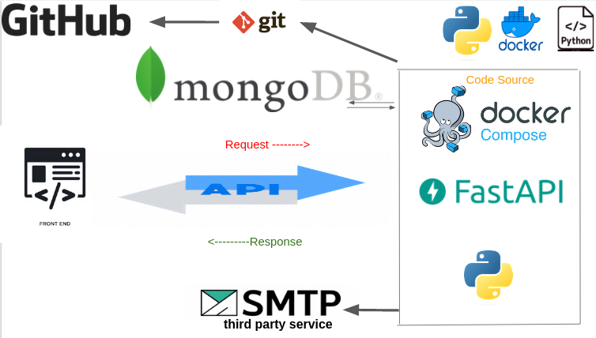

#  Fast API Authentification

## Context

User registrations API using Fastapi and MongoDB .
Support Feactures :
* Create a user with an email and a password. :+1:
* Send an email to the user with a 4 digits code. :+1:
* Activate this account with the 4 digits code received. :+1:
* The user has only one minute to use this code. After that, an error should be raised. :+1:

## Installation

    Install Python requirements.
     
    $ python3 -m venv venv
    $ source venv/bin/activate
    $ pip install -r requirements.txt

    Create .env file and add the following lines 

        `
        MONGO_INITDB_ROOT_USERNAME=
        MONGO_INITDB_ROOT_PASSWORD=
        MONGO_INITDB_DATABASE=dailymotiondb

        DATABASE_URL=mongodb://localhost:27017/dailymotiondb

        CLIENT_ORIGIN=http://localhost:3000
        `

    Start Docker image.

    $ docker-compose up -d

    Run API.

    $ uvicorn app.main:app --host localhost --port 8000 --reload

    Run Test 

    $ pytest

live demo surpport here : http://51.83.77.185:8000/docs

## Architecture schema 

##  File structure

├── app
│   ├── __init__.py
│   ├── config.py
│   ├── main.py
│   ├── database.py
│   ├── email.py
│   ├── main.py
│   ├── schemas.py
│   ├── utils.py
│   └── routers
│   │   ├── __init__.py
│   │   └── auth.py
│   └── serializers
│       ├── __init__.py
│       └── userSerializers.py
├── docker-compose.yml

## RQ
- Verification code is only printing.
